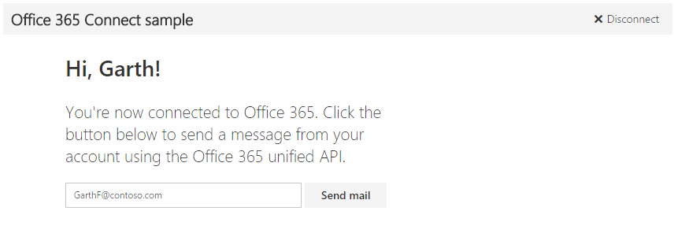

# Office 365 Node.js Connect sample using unified API (preview)

Connecting to Office 365 is the first step every app must take to start working with Office 365 services and data. This sample shows how to connect and then call one API through the unified API (preview), and uses the Office Fabric UI to create an Office 365 experience.



## Prerequisites

To use the Office 365 Node.js Connect sample, you need the following:
* An Office 365 account. You can sign up for [an Office 365 Developer subscription](https://portal.office.com/Signup/Signup.aspx?OfferId=6881A1CB-F4EB-4db3-9F18-388898DAF510&DL=DEVELOPERPACK&ali=1#0) that includes the resources that you need to start building Office 365 apps.

     > Note: If you already have a subscription, the previous link sends you to a page with the message *Sorry, you can’t add that to your current account*. In that case use an account from your current Office 365 subscription.
* A Microsoft Azure tenant to register your application. Azure Active Directory (AD) provides identity services that applications use for authentication and authorization. A trial subscription can be acquired here: [Microsoft Azure](https://account.windowsazure.com/SignUp).

     > Important: You also need to make sure your Azure subscription is bound to your Office 365 tenant. To do this, see the Active Directory team's blog post, [Creating and Managing Multiple Windows Azure Active Directories](http://blogs.technet.com/b/ad/archive/2013/11/08/creating-and-managing-multiple-windows-azure-active-directories.aspx). The section **Adding a new directory** will explain how to do this. You can also see [Set up your Office 365 development environment](https://msdn.microsoft.com/office/office365/howto/setup-development-environment#bk_CreateAzureSubscription) and the section **Associate your Office 365 account with Azure AD to create and manage apps** for more information.
* A client ID, client secret, and redirect URI values of an application registered in Azure. This sample application must be granted the **Send mail as signed-in user** permission for the **Office 365 unified API (preview)**. [Add a web application in Azure](https://github.com/jasonjoh/office365-azure-guides/blob/master/RegisterAnAppInAzure.md) and [grant proper permissions](https://github.com/OfficeDev/O365-Android-Unified-API-Connect/wiki/Grant-permissions-to-the-Connect-application-in-Azure) to it.

     > Note: During the app registration process, make sure to specify **http://localhost:8080/login** as the **Sign-on URL**.
     
* Consult the section [Configure and run the app](#configure-and-run-the-app) for platform specific prerequisites.

## Configure and run the app

## Linux / Windows
Prerequisites
* [```npm```](https://docs.npmjs.com/getting-started/installing-node) - Node Package Manager

Running the app:<br />
1. ```npm install && gulp``` - installs dependencies & starts the application server

## Mac OS X 10.5+
1. ```make all && gulp``` - installs dependencies & starts the application server

## Questions and comments

We'd love to get your feedback about the Office 365 Node.js Connect sample. You can send your questions and suggestions to us in the [Issues](https://github.com/OfficeDev/O365-Nodejs-Unified-API-Connect/issues) section of this repository.

Questions about Office 365 development in general should be posted to [Stack Overflow](http://stackoverflow.com/questions/tagged/Office365+API). Make sure that your questions or comments are tagged with [Office365] and [API].
  
## Additional resources

* [Office 365 APIs platform overview](https://msdn.microsoft.com/office/office365/howto/platform-development-overview)
* [Getting started with Office 365 APIs](http://dev.office.com/getting-started/office365apis)
* [Office 365 unified API overview (preview)](https://msdn.microsoft.com/office/office365/HowTo/office-365-unified-api-overview)
* [Office 365 APIs starter projects and code samples](https://msdn.microsoft.com/office/office365/howto/starter-projects-and-code-samples)
* [Office UI Fabric](https://github.com/OfficeDev/Office-UI-Fabric)

## Copyright
Copyright (c) 2015 Microsoft. All rights reserved.
